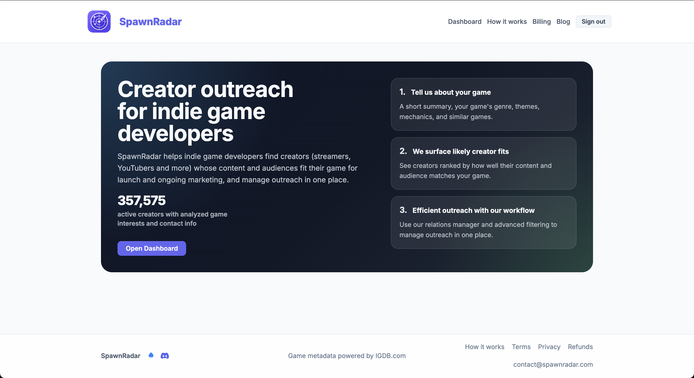
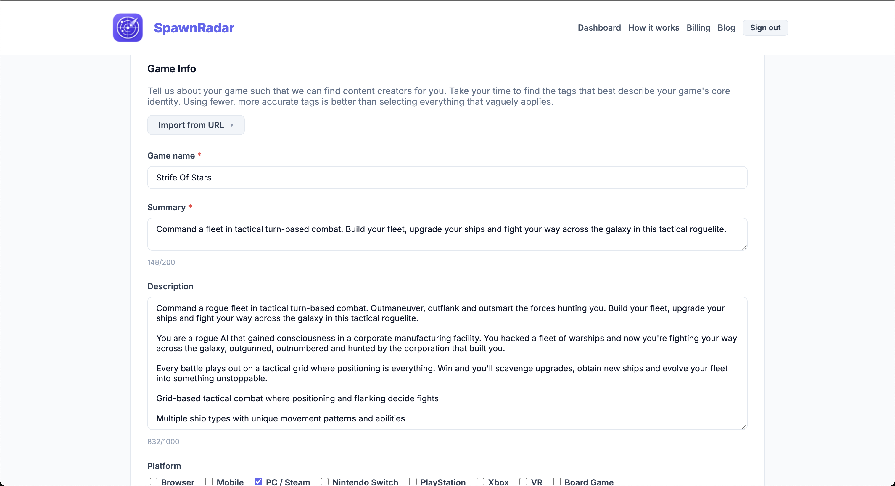
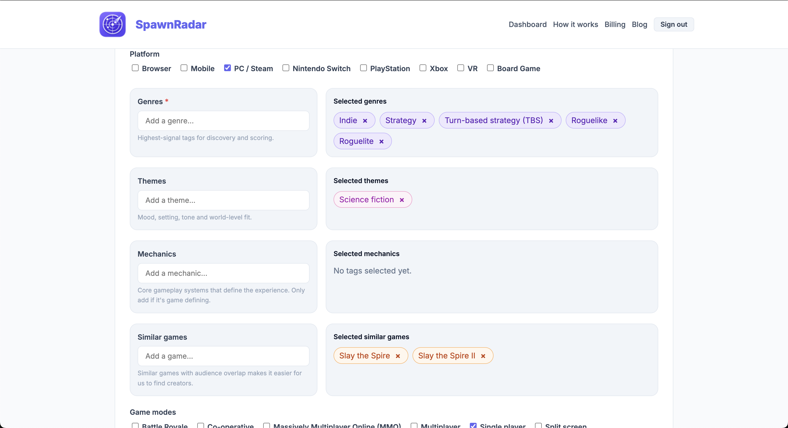
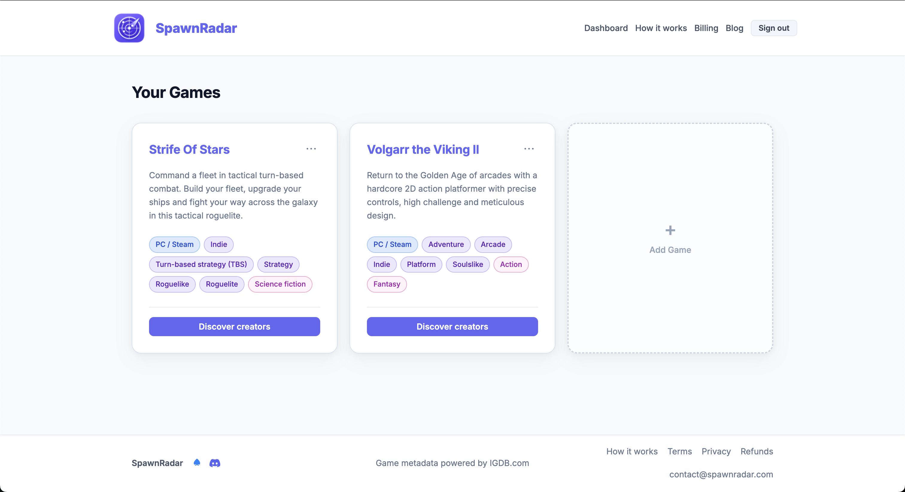
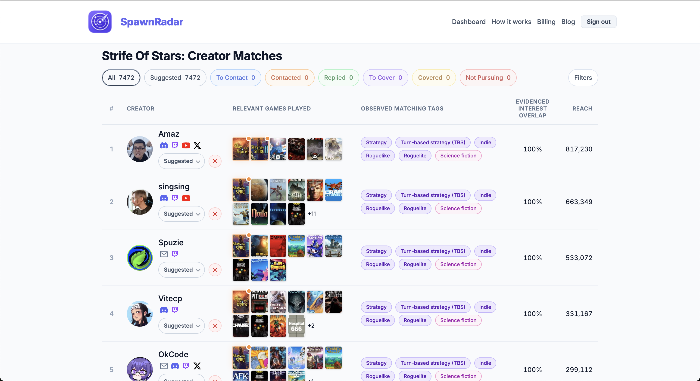
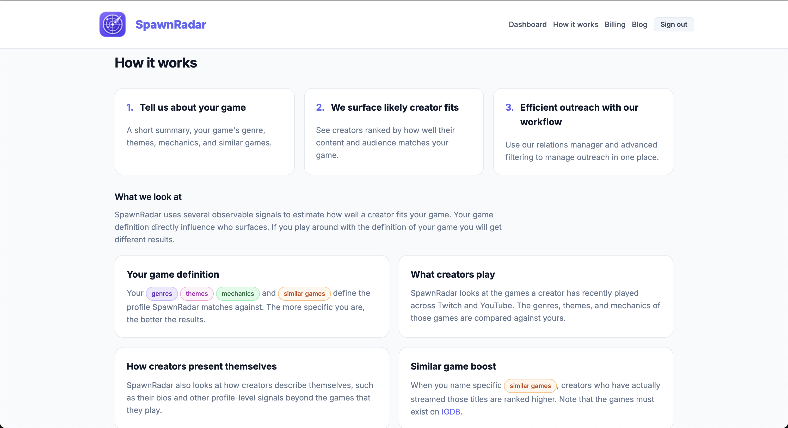
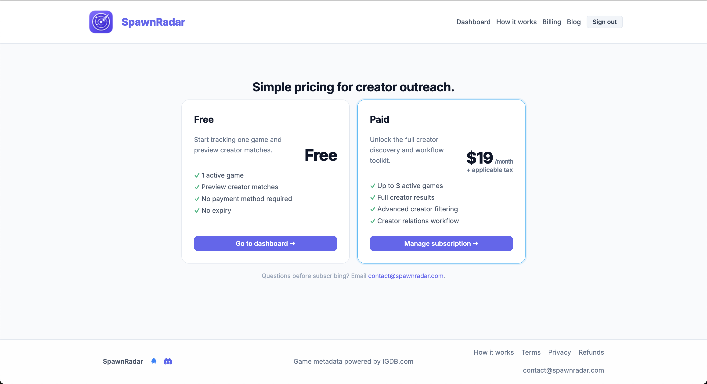

# SpawnRadar

SpawnRadar was a creator discovery and outreach SaaS for indie game developers.

I am shutting it down as a business and keeping this repository as a product and engineering showcase.

## Postmortem

### What I built
- Creator discovery and outreach workflow for indie game developers.
- Matching flow using game metadata, tags, and free-text summaries.
- Payments, auth, email, API integrations, data ingestion, and internal workflow tooling.

### Outcome
- Around 35 people tried it.
- 0 paying customers.
- Positive feedback, but no meaningful retention.

### What I learned
- A pain point can be real without being strong enough to support a self-serve SaaS.
- Indie devs may agree with the workflow idea and still not adopt another tool.
- Low-budget, skeptical users often need more hand-holding than a solo founder can provide cheaply.

## Product showcase

### Homepage
Marketing landing page and top-level positioning.

### Define game: step 1
First step of the game definition and setup flow.

### Define game: step 2
More detailed game metadata and matching inputs.

### Dashboard
Main dashboard for managing games and account state.

### Matches
Ranked creator matches with fit signals and outreach workflow.

### How it works
Public explanation page for the matching workflow.

### Billing
Subscription and payment management flow.

